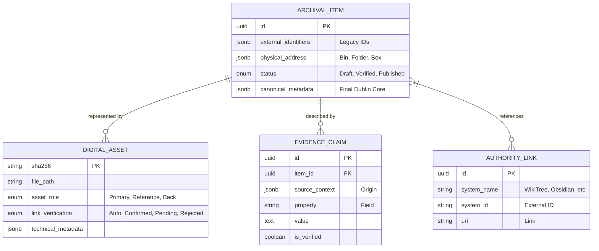

## 1. System Overview
Archive Workbench is a "Staging Area" application designed to reconcile fragmented archival data. It acts as a middleware between raw digital assets (scans), legacy research (catalogs, notes, Tropy), and the public-facing repository (Omeka S). It prioritizes **Evidence Before Narrative** and uses **Deterministic Integrity** for file identity.

## 2. Logical Layers

### A. Ingestion Layer (The "Harvester")
*   **File Watcher:** Recursively scans directories, generates SHA-256 hashes, and registers `DigitalAssets`.
*   **Metadata Adapters:**
    *   **Structured Adapters:** Parses SQLite (Tropy), API/DB (Immich), and XMP/Sidecars (DigiKam).
    *   **Document Parser:** Uses local ROCm LLM to extract structured data from unstructured legacy text.

### B. Reconciliation Layer (The "Matchmaker")
*   **Identity Resolver:**
    1.  **Level 1 (Exact):** Matches by SHA-256 hash. **Status: Auto-Confirmed.**
    2.  **Level 2 (Identifier):** Matches by strings in filenames or metadata. **Status: Pending Review.**
    3.  **Level 3 (Visual):** Uses local VLM (ROCm) to suggest matches between legacy and high-res scans. **Status: Pending Review.**
*   **Verification Gate:** Mandatory human review for all Level 2 and Level 3 proposals.
*   **Conflict Manager:** Flags disparate descriptions from different sources for human resolution.

### C. Curation Layer (The "Workbench")
*   **Evidence Aggregator:** Groups all `EvidenceClaims` under a single `ArchivalItem`.
*   **Synthesis Engine:**
    *   **Local AI (OCR/VLM):** Transcribes marginalia and identifies visual features.
    *   **Prose Assistant:** Generates Dublin Core descriptions from "Verified" evidence.

### D. Publication Layer (The "Bridge")
*   **Omeka S Sync:** Maps the Workbench `ArchivalItem` to Omeka S `Items`.
*   **Media Manager:** Uploads the `Primary_Asset` to the Omeka S API.

---

## 3. Data Model Sketch (Entity-Relationship)



---

## 4. Key Logic Flows

### The "Healing" Flow (Hybrid)
1.  **Input:** New scan `A`.
2.  **Hash Check:** If `A.hash` exists in DB, link immediately as `Auto_Confirmed`.
3.  **Visual Check:** If no hash match, compare `A` against `Reference_Assets`.
4.  **Proposal:** If visual similarity > 90%, create a `Pending` link to the Item.
5.  **Review:** Curator confirms or rejects the `Pending` visual match.

### The "Evidence Synthesis" Flow
1.  **Display:** Workbench shows an image and its aggregated `EvidenceClaims`.
2.  **Action:** Curator selects/edits the most accurate claims.
3.  **Result:** Values are promoted to `Canonical_Metadata`.

### Flow 3: The Narrative Synthesis Flow (Fact + Vision to Story)

1.  **Trigger:** Curator requests a "Draft Description" for an item.
2.  **Context Assembly:** System pulls:
    *   All **Verified** `EvidenceClaims` (People, Dates, Locations, Transcriptions).
    *   Relevant **AuthorityLink** summaries (e.g., "Mary Haushalter (1888–1974), daughter of...").
    *   The **Primary_Asset** (the high-res scan) for visual analysis.
3.  **Prompting:** System sends this context to the Prose Assistant with a "Scholarly Observer" persona.
    *   **Instruction:** "Draft a public-facing archival description in a single, cohesive paragraph. Synthesize the provided metadata with objective visual evidence visible in the image (e.g., clothing style, architectural details, photographic process, physical condition).
    *   **Constraints:**
        *   **Tone:** Neutral, scholarly, and descriptive.
        *   **Prohibited:** No sentimental filler (e.g., 'a glimpse into the past', 'heartwarming'), no speculative narrative, and no 'AI-isms' (e.g., 'the photo captures...').
        *   **Certainty:** Only include visual conclusions that are certain. If a detail is ambiguous, describe it as such or omit it."
4.  **Drafting:** System stores the output in a `Draft_Description` field.
5.  **Editorial Review:** Curator reviews the draft.
    *   **Edit:** Curator refines the scholarly tone or corrects visual misinterpretations.
    *   **Approve:** Text is moved to `Canonical_Metadata` (Dublin Core: Description).
6.  **Final State:** Item status moves to `Ready for Publication`.

---

## 5. Technology Stack
*   **Backend:** Python (FastAPI)
*   **Database:** PostgreSQL with JSONB
*   **AI:** Ollama/ROCm (Local)
*   **Frontend:** React/TypeScript
*   **Task Queue:** Celery/Redis

---
We can conclude Phase 0 here. A clean, modular folder structure is essential for a "Staging Area" project, as it needs to separate the **Ingestion** (getting data in), **Logic** (reconciling it), and **Publication** (getting it out).

Since we are using **FastAPI** (Backend), **React/TypeScript** (Frontend), and **Celery/Redis** (Workers), I recommend the following structure for your repository:

### Recommended Folder Structure: `archive-workbench/`

```text
archive-workbench/
├── backend/                # FastAPI Application
│   ├── app/
│   │   ├── api/            # API Endpoints (Items, Assets, Evidence)
│   │   ├── core/           # Config, Security, Hashing Logic
│   │   ├── crud/           # DB Operations
│   │   ├── models/         # SQLAlchemy/SQLModel (The Schema we designed)
│   │   ├── schemas/        # Pydantic models for API validation
│   │   ├── services/       # Business Logic (The "Matchmaker" & "Synthesizer")
│   │   │   ├── adapters/   # Tropy, Immich, DigiKam, Carl's Catalog
│   │   │   ├── ai/         # ROCm/Ollama integration & Prompt Templates
│   │   │   └── omeka/      # Omeka S API Bridge
│   │   └── db/             # Migrations (Alembic) and Session management
│   ├── main.py             # Entry point
│   └── requirements.txt
├── frontend/               # React/TypeScript Application
│   ├── src/
│   │   ├── components/     # Curation View, Evidence Sidebar, Matchmaker UI
│   │   ├── hooks/          # API interaction hooks
│   │   ├── store/          # State management (Zustand/Redux)
│   │   └── types/          # TypeScript interfaces matching the Schema
│   ├── package.json
│   └── tsconfig.json
├── workers/                # Background Tasks (Celery/Redis)
│   ├── tasks/
│   │   ├── hashing.py      # SHA-256 generation
│   │   └── vision.py       # ROCm-accelerated VLM/OCR tasks
│   └── worker.py
├── data/                   # Local Staging (Git-ignored)
│   ├── raw/                # Symlinks or copies of original scans
│   ├── reference/          # Carl's low-res scans for matching
│   └── exports/            # Prepared JSON for Omeka S
├── docs/                   # Documentation
│   ├── architecture/       # The v1.3 Document and ERDs
│   ├── hierarchy/          # Physical Finding Aid (Series/Box/Folder)
│   └── api/                # API Specs
├── docker-compose.yml      # Orchestration for Postgres, Redis, and App
├── .gitignore              # Crucial: Ignore large assets and DB files
└── README.md
```

### Key Considerations for this Structure:

1.  **The `data/` directory:** This is your local "Staging Area." It should not contain the actual archive (which stays in your main storage), but rather the **working copies** or **symlinks** the Workbench is currently processing.
2.  **The `adapters/` pattern:** By putting Tropy, Immich, and Carl's Catalog into an `adapters` folder, you make the system reusable. If you add a new source (like a spreadsheet from a different relative), you just write a new adapter.
3.  **Separation of `ai/`:** Keeping the AI logic (prompts and ROCm calls) separate from the API logic allows you to swap models (e.g., switching from Llama-3-Vision to a newer model) without breaking the curation workflow.
4.  **The `workers/` directory:** Since hashing thousands of files and running VLMs is resource-intensive, these must live in background workers so your UI doesn't freeze.